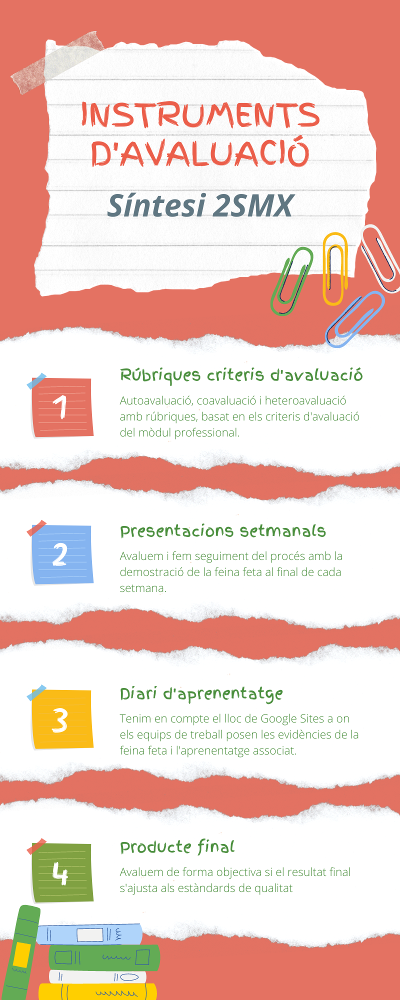

Unitat 2
=========

Tasca lliurable de la Unitat 2 del segon curs d'curs #activaFPmooc.

> La guia de l'alumnat serveix perquè els i les nostres alumnes tinguin clares les regles de joc. És important transmetre-les de forma entendedora i que el procés sigui transparent.
>
> Per aconseguir una avaluació justa i equilibrada, cal que els instruments d'avaluació siguin diversos. Quin tipus d'instrument d'avaluació fas servir en els projectes i per a què els fas servir?
>
> Presenta-ho als companys i companyes en forma d'infografia.

[Veure en PDF](Instruments-davaluacio.pdf)

El disseny s'ha realitzat amb la eina [Canva](https://www.canva.com/).