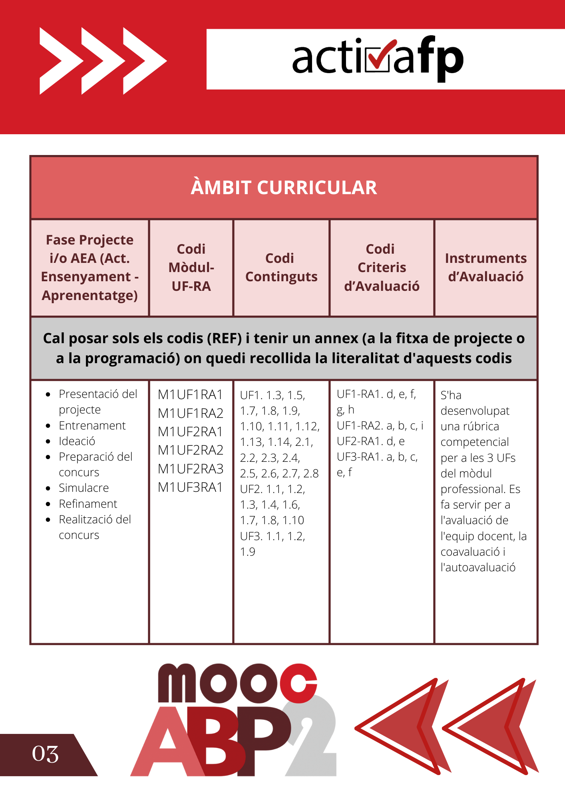
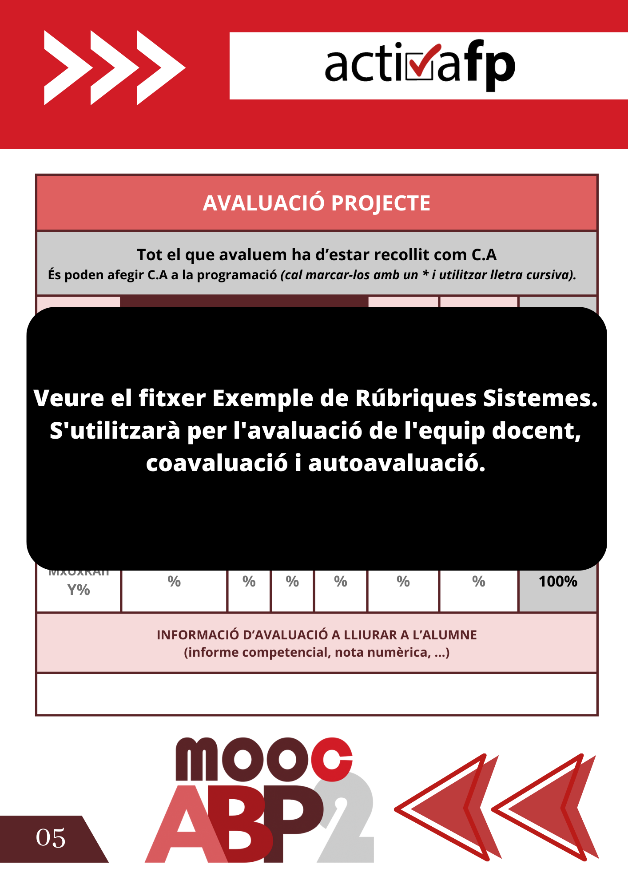

Unitat 4
=========

Tasca lliurable de la Unitat 4 del segon curs d'curs #activaFPmooc.

> Ara, com tancament d'aquest Mooc2, us demanem que elaboreu una fitxa completa d'un d'aquests projectes, del que trieu.
>
>Vam concloure el Mooc1, si recordeu, fen un prototip del projecte, el Canva del projecte, ara acabem ja amb la fitxa desenvolupada. Podeu agafar aquell prototip i evolucionar-lo fins a convertir-lo en la fitxa del projecte, fitxa que podria annexar-se a la programació del mòdul o mòduls o cicle (si hi ha programació de cicle).

Fitxa
-----

[Veure en PDF](fitxa-projecte-hacking-day.pdf)

El disseny s'ha realitzat amb la eina [Canva](https://www.canva.com/).

Rúbriques
----------

[Veure sencer en PDF](exemple-rubrica-sistemes.pdf)