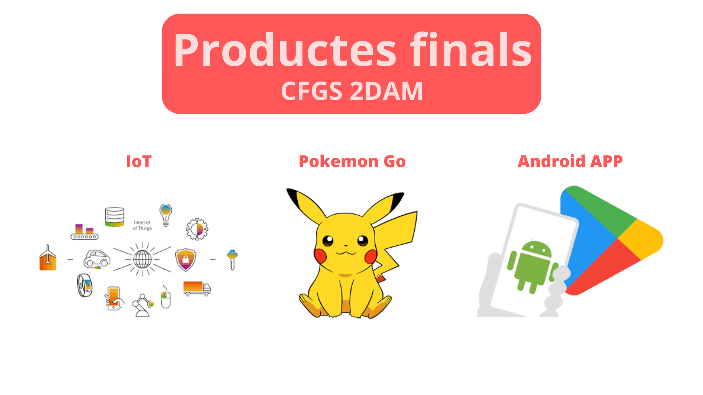

Unitat 3
=========

Tasca lliurable de la Unitat 3 del segon curs d'curs #activaFPmooc.

> Seguint el currículum del teu mòdul, mòduls que podries treballar de forma transversal o cicle, pensa en tots els possibles productes finals o serveis que podem demanar al nostre alumnat, de manera que siguin l'eix vertebrador del procés d'ensenyament - aprenentatge seguint la metodologia ABP. 
>
> Novament, plasma tots aquests possibles productes en un suport gràfic com pot ser un llenç digital que creïs amb eines com Linoit, Mural, Miro, Canva, Genially, etc. 
>
> No oblidis compartir totes les teves creacions en les xarxes del curs amb l'etiqueteu.

[Veure en PDF](productes-finals.pdf)

El disseny s'ha realitzat amb la eina [Canva](https://www.canva.com/).