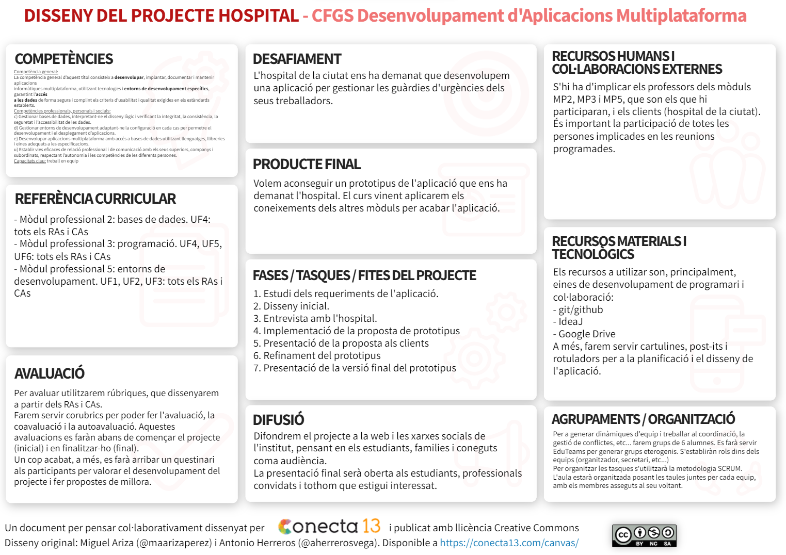
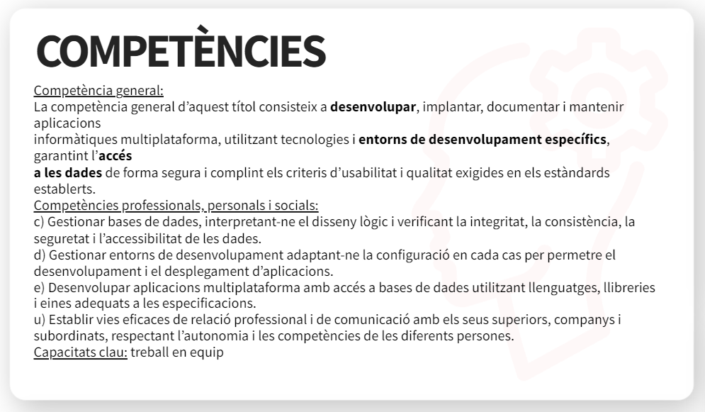

Projecte Hospital
=================

L'hospital de la ciutat ens ha demanat que li desenvolupem una aplicació per a gestionar les guàrdies dels seus treballadors i treballadores. Com a resposta a aquesta petició, l'equip docent de l'institut ha decidit crear equips de desenvolupament amb els alumnes del primer curs del cicle formatiu de grau superior de desenvolupament d'aplicacions multiplataforma. L'objectiu és crear un prototipus.

En cas que l'evolució sigui positiva, durant el segon curs s'acabaria de desenvolupar l'aplicació, ja que caldrien les competències associades als mòduls professionals de segon.

[**Accés al disseny**](https://view.genial.ly/63fcc74d2cfb7400137d1fe9/interactive-content-canvas-projectes-abp)

