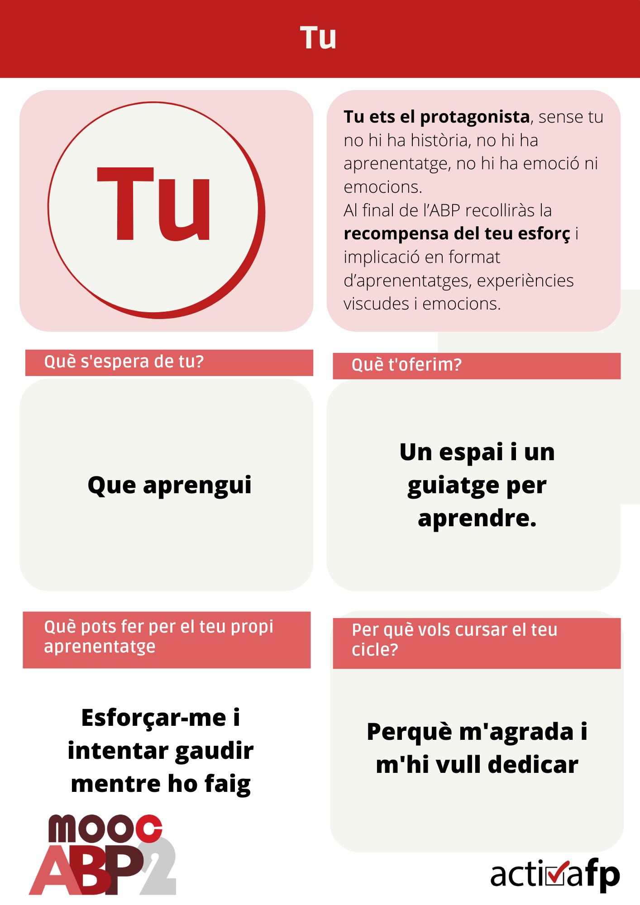
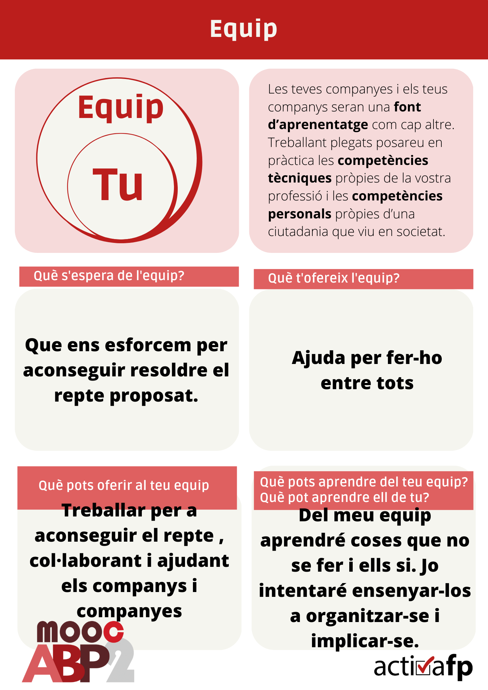
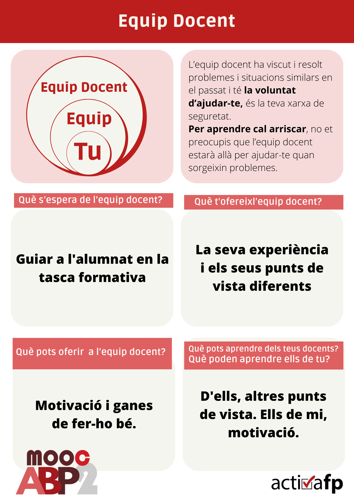
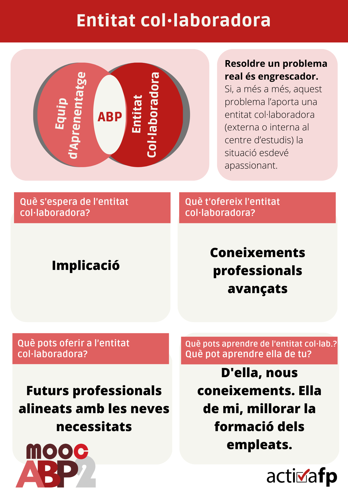
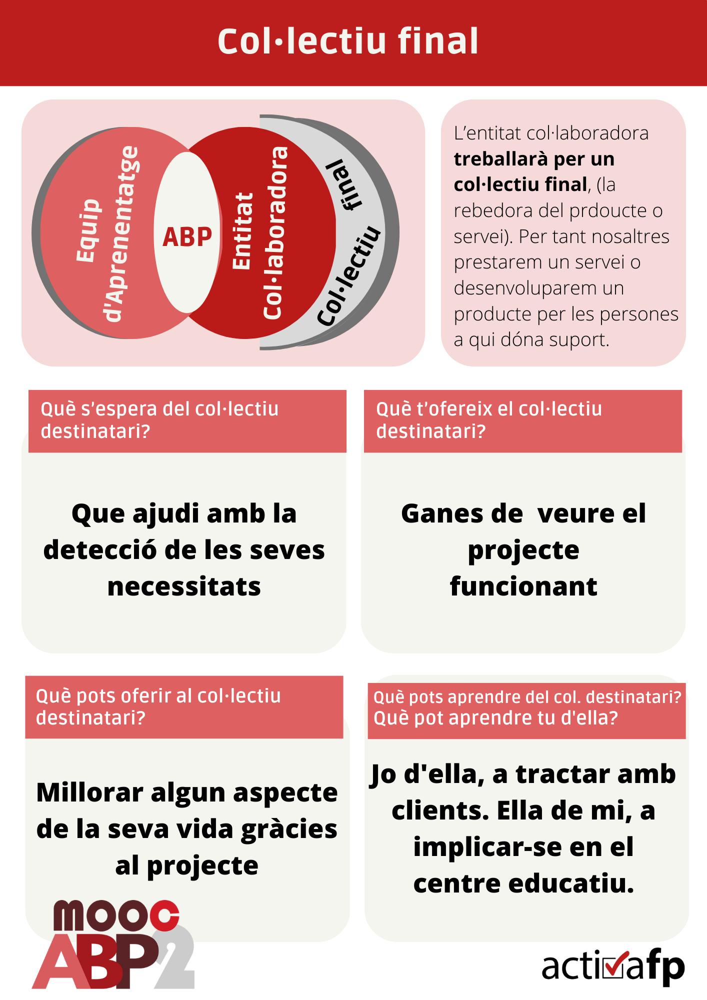
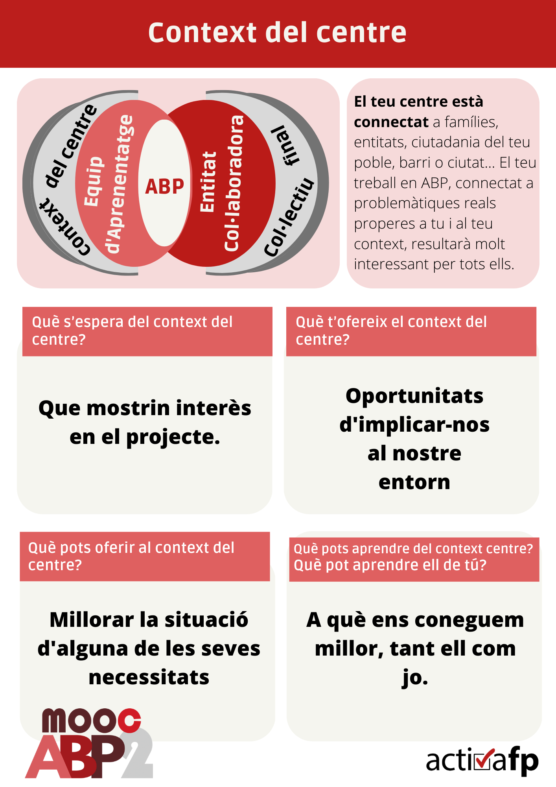

Unitat 1
========

Tasca lliurable de la Unitat 1 del segon curs d'curs #activaFPmooc.

> Com ja haureu comprovat és molt important, quan treballem per ABP, generar **espais per la reflexió**, primerament, a nivell individual i, desprès, com equips docent i, com equips d’aprenentatge. Els espais de reflexió també hem de compartir-los amb els i les nostres alumnes.
>
> **Et convidem a completar els organitzadors de manera individual**. Estaria bé que ho transfereixes al teu equip docent. Convida'ls a que els emplenen també i compartiu els punts de vista, serà una tasca molt productiva, que us permetrà com col·lectiu, enganxar a l’alumne, discernir on podeu centrar la seva **atenció**, fomentant la seva **motivació**.

[Descarregar en pdf](reflexio-motivacio-actors-abp.pdf)

